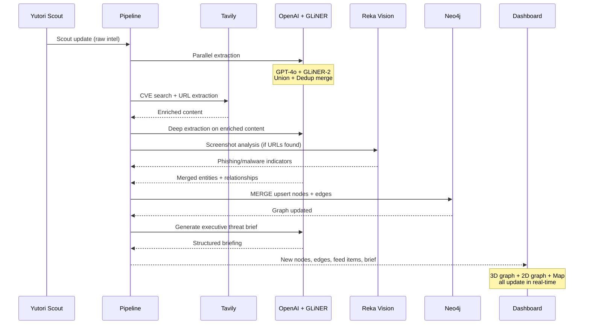
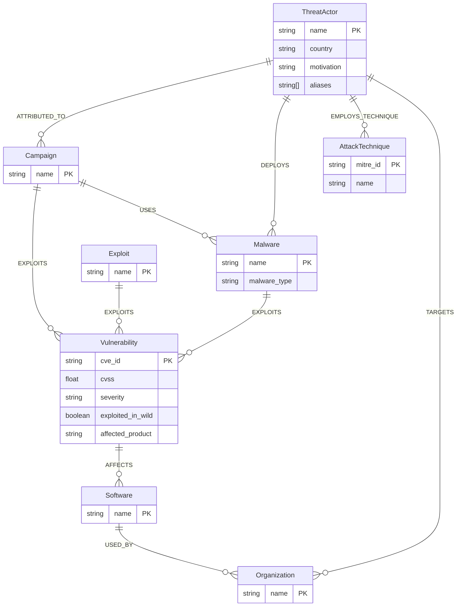

<div align="center">

<br />

<picture>
  <source media="(prefers-color-scheme: dark)" srcset="https://img.shields.io/badge/ARGUS-FF0040?style=for-the-badge&logoColor=white&logo=data:image/svg+xml;base64,PHN2ZyB4bWxucz0iaHR0cDovL3d3dy53My5vcmcvMjAwMC9zdmciIHZpZXdCb3g9IjAgMCAyNCAyNCIgZmlsbD0id2hpdGUiPjxjaXJjbGUgY3g9IjEyIiBjeT0iMTIiIHI9IjMiLz48Y2lyY2xlIGN4PSIxMiIgY3k9IjEyIiByPSI4IiBmaWxsPSJub25lIiBzdHJva2U9IndoaXRlIiBzdHJva2Utd2lkdGg9IjEuNSIgb3BhY2l0eT0iMC42Ii8+PGNpcmNsZSBjeD0iMTIiIGN5PSIxMiIgcj0iMTEiIGZpbGw9Im5vbmUiIHN0cm9rZT0id2hpdGUiIHN0cm9rZS13aWR0aD0iMSIgb3BhY2l0eT0iMC4zIi8+PGxpbmUgeDE9IjEyIiB5MT0iMSIgeDI9IjEyIiB5Mj0iNCIgc3Ryb2tlPSJ3aGl0ZSIgc3Ryb2tlLXdpZHRoPSIxLjUiLz48bGluZSB4MT0iMTIiIHkxPSIyMCIgeDI9IjEyIiB5Mj0iMjMiIHN0cm9rZT0id2hpdGUiIHN0cm9rZS13aWR0aD0iMS41Ii8+PGxpbmUgeDE9IjEiIHkxPSIxMiIgeDI9IjQiIHkyPSIxMiIgc3Ryb2tlPSJ3aGl0ZSIgc3Ryb2tlLXdpZHRoPSIxLjUiLz48bGluZSB4MT0iMjAiIHkxPSIxMiIgeDI9IjIzIiB5Mj0iMTIiIHN0cm9rZT0id2hpdGUiIHN0cm9rZS13aWR0aD0iMS41Ii8+PC9zdmc+" />
  
</picture>

# ARGUS

**Autonomous Cyber Threat Intelligence Platform**

Deploys AI agents to continuously monitor the threat landscape, extract structured intelligence,<br/>
and visualize attack relationships in a real-time 3D knowledge graph.

<br />

[](https://lu.ma/autonomous-agents-hackathon)
[](https://nextjs.org)
[](https://typescriptlang.org)
[](https://react.dev)
[](https://neo4j.com)
[](https://threejs.org)
[](https://d3js.org)

<br />

[Get Started](#-get-started) &nbsp;&middot;&nbsp; [Features](#-features) &nbsp;&middot;&nbsp; [Architecture](#-architecture) &nbsp;&middot;&nbsp; [Sponsors](#-sponsor-integrations) &nbsp;&middot;&nbsp; [API Reference](#-api-reference) &nbsp;&middot;&nbsp; [Pipeline](#-pipeline-flow)

<br />

</div>

---

## Why

In February 2026, CISA lost most of its workforce due to government restructuring. Proactive threat scanning and vulnerability coordination ground to a halt overnight.

ARGUS fills that gap. Autonomous AI agents continuously monitor threat feeds, extract structured intelligence, and build a living knowledge graph — **no human operator required**.

> [!IMPORTANT]
> ARGUS deploys persistent Yutori scouts that monitor CVE databases, security feeds, and dark web forums 24/7. Every new finding is automatically extracted, enriched, ingested into Neo4j, and visualized in real-time across a 3D graph, 2D network, and global attack map.

<br />

## Get Started

<details open>
<summary><strong>Quick Start</strong></summary>

<br />

```bash
git clone https://github.com/nihalnihalani/ARGUS.git
cd ARGUS/threat-graph
npm install
npm run seed    # Seed Neo4j with 2026 threat intelligence data
npm run dev     # Start at http://localhost:3000
```

</details>

<details>
<summary><strong>Environment Variables</strong></summary>

<br />

Create `.env.local` in the `threat-graph/` directory:

```env
# Neo4j — from console.neo4j.io
NEO4J_URI=neo4j+s://...
NEO4J_USERNAME=neo4j
NEO4J_PASSWORD=your-password
NEO4J_DATABASE=neo4j

# Yutori — from platform.yutori.com/settings
YUTORI_API_KEY=yut_...

# Tavily — from app.tavily.com
TAVILY_API_KEY=tvly-...

# OpenAI — from platform.openai.com
OPENAI_API_KEY=sk-...

# GLiNER (Fastino Labs / Pioneer) — from pioneer.ai
GLINER_API_KEY=...

# Reka — from dashboard.reka.ai
REKA_API_KEY=...

# Pipeline Auth (optional)
PIPELINE_SECRET=your-secret
```

</details>

<details>
<summary><strong>Prerequisites</strong></summary>

<br />

- Node.js 20+
- Neo4j database instance (local or [Aura Free](https://console.neo4j.io))
- API keys for: Yutori, Tavily, OpenAI, GLiNER (Pioneer), Reka

</details>

<br />

## Features

<table>
<tr>
<td width="50%" valign="top">

### Visualization

- **3D Force Graph** — Three.js with bloom glow, directional particles, fly-to camera, auto-rotate
- **2D Network Graph** — D3.js SVG force layout with per-type shapes, drag, zoom, attack path highlighting
- **Global Attack Map** — deck.gl + MapLibre GL with animated great-circle arcs between threat origins and targets
- **Real-Time Live Feed** — streaming intelligence feed from scouts with severity filtering

</td>
<td width="50%" valign="top">

### Intelligence

- **Autonomous Scouting** — Yutori agents continuously monitor CVE databases, Twitter/X, GitHub PoCs, and news
- **Deep Investigation** — one-click deep research on any graph node via Yutori Research API
- **Dual NER Pipeline** — OpenAI GPT-4o + GLiNER-2 extract entities in parallel, merged with dedup
- **Executive Briefings** — AI-generated threat assessments with recommended actions

</td>
</tr>
<tr>
<td width="50%" valign="top">

### Knowledge Graph

- **8 Entity Types** — ThreatActor, Vulnerability, Exploit, Software, Organization, Malware, Campaign, AttackTechnique
- **Attack Path Analysis** — Neo4j `shortestPath` reveals how actors reach targets through up to 6 hops
- **MERGE Upserts** — idempotent ingestion, no duplicates
- **Geo-Resolved Arcs** — attack origins mapped to real-world coordinates

</td>
<td width="50%" valign="top">

### Sponsor Integrations

- **Visual Threat Analysis** — Reka Vision analyzes screenshots for phishing, malware C2 panels, dark web forums
- **NER Comparison** — side-by-side GLiNER vs OpenAI extraction with F1 score
- **Trajectory Viewer** — step-by-step replay of Yutori browser automation with screenshots
- **Voice Analysis** — Modulate vishing/deepfake detection (architected, awaiting API)

</td>
</tr>
</table>

<br />

## What Makes This Different

| | ARGUS | Traditional SIEM |
|---|:---:|:---:|
| Fully autonomous — no human operator | **Yes** | No |
| Deploys persistent monitoring agents | **Yes** | Manual rules |
| 3D knowledge graph visualization | **Yes** | Flat dashboards |
| Dual NER (GPT-4o + GLiNER in parallel) | **Yes** | Single extractor |
| Screenshot analysis (phishing/C2/forums) | **Yes** | No |
| Attack path discovery (graph shortest path) | **Yes** | Limited |
| Browser automation with trajectory replay | **Yes** | No |
| AI-generated executive threat briefings | **Yes** | Manual reports |

<br />

## Architecture

```mermaid
graph TB
    subgraph Collection["Data Collection — Yutori"]
        Scouting["Scouting API<br/><code>Persistent monitors</code>"]
        Browsing["Browsing API<br/><code>Browser automation</code>"]
        Research["Research API<br/><code>Deep investigation</code>"]
    end

    subgraph Enrichment["Enrichment — Tavily"]
        Search["Search<br/><code>CVE news</code>"]
        Extract["Extract<br/><code>IOCs from URLs</code>"]
        Crawl["Crawl<br/><code>Site traversal</code>"]
    end

    subgraph Extraction["Extraction Layer (Parallel)"]
        OpenAI["OpenAI GPT-4o<br/><code>Structured extraction</code>"]
        GLiNER["GLiNER-2<br/><code>Zero-shot NER</code>"]
        Reka["Reka Vision<br/><code>Screenshot analysis</code>"]
    end

    subgraph Graph["Knowledge Graph — Neo4j"]
        Nodes["8 Node Types<br/><code>ThreatActor · Vulnerability · Exploit</code><br/><code>Software · Organization · Malware</code><br/><code>Campaign · AttackTechnique</code>"]
        Paths["Attack Path Queries<br/><code>shortestPath up to 6 hops</code>"]
    end

    subgraph Viz["Visualization Layer"]
        ThreeD["3D Force Graph<br/><code>Three.js + Bloom</code>"]
        TwoD["2D Force Graph<br/><code>D3.js SVG</code>"]
        Map["Global Attack Map<br/><code>deck.gl + MapLibre</code>"]
    end

    Collection -->|"Scout updates"| Extraction
    Collection -->|"Source URLs"| Enrichment
    Enrichment -->|"Raw content"| Extraction
    Extraction -->|"Entities + Relationships"| Graph
    Graph -->|"Graph data"| Viz

    style Collection fill:#1e1b4b,stroke:#7c3aed,color:#e0e7ff
    style Enrichment fill:#172554,stroke:#3b82f6,color:#e0e7ff
    style Extraction fill:#1a1a2e,stroke:#f59e0b,color:#e0e7ff
    style Graph fill:#0f2e1a,stroke:#22c55e,color:#e0e7ff
    style Viz fill:#2a0a1e,stroke:#ec4899,color:#e0e7ff
```



### Pipeline Data Flow



<br />

## Sponsor Integrations

<table>
<tr>
<td width="33%" valign="top">

###  Yutori

**Autonomous Data Collection**

All 3 API surfaces + webhooks:

- **Scouting** — persistent monitors with structured output schemas, configurable intervals, webhook push
- **Browsing** — OSINT investigation via browser automation with step-by-step trajectory + screenshots
- **Research** — deep web research for threat actor/CVE deep-dives

`src/lib/yutori.ts` · 9 scouting endpoints · 3 browsing endpoints · 2 research endpoints

</td>
<td width="33%" valign="top">

###  Tavily

**Web Intelligence**

All 5 API features:

- **Search** — advanced CVE news + threat intel search with domain filtering
- **Extract** — structured content from up to 20 URLs simultaneously
- **Map** — URL structure discovery for threat intel sites
- **Crawl** — graph-based traversal with map+extract fallback
- **Research** — multi-step automated synthesis

`src/lib/tavily.ts` · 5 endpoint wrappers

</td>
<td width="33%" valign="top">

###  Neo4j

**Knowledge Graph**

Full graph database with attack path analysis:

- **8 node labels** + **10+ relationship types**
- **MERGE upserts** for idempotent ingestion
- **shortestPath** queries (actor → target, up to 6 hops)
- **Allowlist validation** prevents Cypher injection
- Pre-seeded with 100+ entities and hundreds of relationships

`src/lib/neo4j.ts` · Cypher query builder

</td>
</tr>
<tr>
<td width="33%" valign="top">

###  OpenAI

**Entity Extraction & Briefings**

GPT-4o with structured outputs:

- **JSON Schema extraction** — entities, relationships, IOCs with full metadata
- **Executive briefings** — threat level, top threats, attack paths, CISA relevance
- **Function calling** — autonomous tool selection (search_cve, investigate_ip, research_actor, enrich_malware)
- **Embeddings** — text-embedding-3-large for semantic search

`src/lib/openai-client.ts` · `src/lib/schema.ts`

</td>
<td width="33%" valign="top">

###  Fastino Labs (GLiNER-2)

**Zero-Shot NER**

Pioneer API for parallel extraction:

- **15 cyber entity labels** — threat_actor, malware, cve_id, ip_address, domain, hash, and more
- **8 threat classifications** — ransomware, apt, phishing, zero_day, supply_chain, etc.
- **Parallel pipeline** — runs alongside OpenAI via `Promise.allSettled()`, results merged with dedup
- **Comparison UI** — side-by-side extraction with F1 score estimate

`src/lib/fastino.ts` · `ExtractionComparison.tsx`

</td>
<td width="33%" valign="top">

###  Reka Vision

**Screenshot Analysis**

Reka Flash multimodal vision:

- **Phishing detection** — fake login forms, brand impersonation, suspicious URLs
- **Forum analysis** — dark web forum threat actor/CVE/malware extraction
- **C2 panel analysis** — malware family, victim stats, campaign details
- **Auto-classification** — routes screenshots to the correct specialist analyzer
- **Trajectory analysis** — Reka + Yutori browsing combined

`src/lib/reka.ts` · `VisionAnalysis.tsx`

</td>
</tr>
<tr>
<td width="33%" valign="top">

###  Modulate

**Voice Threat Detection** *(Stub)*

Architected for production integration:

- **Vishing detection** — social engineering pattern analysis
- **Deepfake audio** — TruVoice biometric/spectral analysis
- **Toxicity scoring** — real-time speech monitoring
- Returns `isStub: true` — production-ready types and signatures

`src/lib/modulate.ts`

</td>
<td colspan="2" valign="top">

### Sponsor Synergies

The real power is in the **combinations**:

1. **Yutori Scout** delivers update → **GLiNER + OpenAI** extract in parallel → **Tavily** enriches CVEs → **Neo4j** stores graph → **3D visualization** updates live
2. **Yutori Browser** investigates a URL → captures trajectory screenshots → **Reka Vision** analyzes each step for phishing/malware
3. **GLiNER vs OpenAI** comparison panel shows extraction differences with F1 scores
4. Click a ThreatActor → **Neo4j shortestPath** reveals attack chain → highlighted across **3D graph + 2D graph + attack map**

</td>
</tr>
</table>

<br />

## API Reference

### Core Pipeline

| Route | Method | Description |
|:------|:-------|:------------|
| **`/api/pipeline/ingest`** | POST | Full 7-step ingest pipeline — extraction, enrichment, Neo4j write, briefing generation |
| **`/api/analyze`** | POST | OpenAI threat classification with autonomous tool selection |

### Neo4j Graph

| Route | Method | Description |
|:------|:-------|:------------|
| **`/api/graph/query`** | GET | Fetch full knowledge graph with geo-resolved coordinates |
| **`/api/graph/ingest`** | POST | Bulk upsert nodes and relationships |
| **`/api/graph/path`** | POST | Find shortest attack path (actor → target, up to 6 hops) |
| **`/api/graph/stats`** | GET | Aggregate statistics (nodes, edges, actors, vulns, criticals) |

### Yutori

| Route | Method | Description |
|:------|:-------|:------------|
| **`/api/scouts/create`** | POST | Deploy persistent monitoring scouts |
| **`/api/scouts/poll`** | GET | Poll scouts for updates (supports multi-scout) |
| **`/api/scouts/manage`** | GET/PATCH/POST/DELETE | List, update, stop, or delete scouts |
| **`/api/scouts/webhook`** | POST | Receive Yutori webhook push notifications |
| **`/api/scouts/restart`** | PUT | Edit and restart a scout with new query |
| **`/api/scouts/email-settings`** | PUT | Manage scout email subscribers |
| **`/api/browse/investigate`** | POST/GET | Launch or poll WHOIS/DNS investigation |
| **`/api/browse/trajectory`** | GET | Download step-by-step browsing trajectory |
| **`/api/research/deepdive`** | POST/GET | Launch or poll deep research task |

### Tavily

| Route | Method | Description |
|:------|:-------|:------------|
| **`/api/tavily/search`** | POST | Web search with domain filtering and depth control |
| **`/api/tavily/extract`** | POST | Extract structured content from up to 20 URLs |
| **`/api/tavily/map`** | POST | Discover URL structure of a website |
| **`/api/tavily/crawl`** | POST | Graph-based site crawl with fallback |
| **`/api/tavily/research`** | POST | Multi-step research synthesis |

### Sponsor Endpoints

| Route | Method | Description |
|:------|:-------|:------------|
| **`/api/gliner/extract`** | POST | GLiNER-2 entity extraction (15 cyber labels) |
| **`/api/gliner/compare`** | POST | Side-by-side GLiNER vs OpenAI extraction with F1 |
| **`/api/reka/analyze`** | POST | Reka Vision screenshot analysis (auto-classifies type) |
| **`/api/reka/trajectory-analyze`** | POST | Reka analysis of Yutori browsing trajectory screenshots |
| **`/api/modulate/analyze`** | POST | Modulate voice analysis (stub) |

<br />

## Pipeline Flow

When a Yutori scout delivers an update, the ingest pipeline processes it through **7 steps**:

```mermaid
graph LR
    A["1. Extract<br/><code>GLiNER + OpenAI</code><br/><code>(parallel)</code>"] --> B["2. Enrich CVEs<br/><code>Tavily Search</code>"]
    B --> C["3. Screenshot<br/><code>Reka Vision</code>"]
    C --> D["4. Deep Extract<br/><code>GLiNER + OpenAI</code><br/><code>(on enriched)</code>"]
    D --> E["5. Neo4j Write<br/><code>MERGE upserts</code>"]
    E --> F["6. Feed Items<br/><code>Live feed</code>"]
    F --> G["7. Threat Brief<br/><code>GPT-4o</code>"]

    style A fill:#f59e0b,stroke:#d97706,color:#000
    style B fill:#3b82f6,stroke:#2563eb,color:#fff
    style C fill:#10b981,stroke:#059669,color:#fff
    style D fill:#f59e0b,stroke:#d97706,color:#000
    style E fill:#22c55e,stroke:#16a34a,color:#fff
    style F fill:#8b5cf6,stroke:#7c3aed,color:#fff
    style G fill:#ec4899,stroke:#db2777,color:#fff
```



| Step | What Happens | Sponsor |
|:-----|:-------------|:--------|
| **1. Entity Extraction** | Parse Yutori structured JSON; fallback to parallel GLiNER + OpenAI with union + dedup merge | OpenAI, Fastino Labs |
| **2. CVE Enrichment** | Tavily advanced search for latest news on each detected CVE | Tavily |
| **3. Screenshot Analysis** | Reka Vision analyzes any screenshot URLs (phishing, C2, forums) | Reka |
| **4. Deep Extraction** | Second-pass GLiNER + OpenAI extraction on Tavily-extracted content | OpenAI, Fastino Labs, Tavily |
| **5. Neo4j Write** | MERGE all entities and relationships into the knowledge graph | Neo4j |
| **6. Feed Generation** | Build live feed items from findings and enrichment results | — |
| **7. Threat Briefing** | GPT-4o generates executive briefing from graph state + new findings | OpenAI |

<br />

## Tech Stack

| Layer | Technology |
|:------|:-----------|
| **Framework** | Next.js 16 (App Router, React 19, RSC) |
| **Language** | TypeScript (strict) |
| **UI** | shadcn/ui, Radix UI, Tailwind CSS 4, Framer Motion |
| **3D Visualization** | Three.js, react-force-graph-3d, three-spritetext, UnrealBloomPass |
| **2D Visualization** | D3.js (force simulation + SVG) |
| **Map** | deck.gl, MapLibre GL, react-map-gl |
| **Graph Database** | Neo4j (neo4j-driver) |
| **AI / NER** | OpenAI GPT-4o, GLiNER-2 (Pioneer API) |
| **Vision AI** | Reka Flash |
| **Web Intelligence** | Tavily (Search, Extract, Map, Crawl, Research) |
| **Autonomous Agents** | Yutori (Scouting, Browsing, Research) |
| **Voice Analysis** | Modulate (stub) |

<br />

<details>
<summary><strong>Project Structure</strong></summary>

<br />

```
threat-graph/
├── src/
│   ├── app/
│   │   ├── api/
│   │   │   ├── pipeline/ingest/     # 7-step ingest pipeline
│   │   │   ├── graph/               # Neo4j CRUD (query, ingest, path, stats)
│   │   │   ├── scouts/              # Yutori scout management (create, poll, manage, webhook)
│   │   │   ├── browse/              # Yutori browsing (investigate, trajectory)
│   │   │   ├── research/            # Yutori deep research (deepdive)
│   │   │   ├── tavily/              # Tavily (search, extract, map, crawl, research)
│   │   │   ├── gliner/              # GLiNER NER (extract, compare)
│   │   │   ├── reka/                # Reka Vision (analyze, trajectory-analyze)
│   │   │   ├── modulate/            # Modulate voice analysis (stub)
│   │   │   └── analyze/             # OpenAI threat classification
│   │   ├── dashboard/page.tsx       # Main dashboard page
│   │   └── page.tsx                 # Landing page
│   ├── components/
│   │   ├── Dashboard.tsx            # Main orchestrator — state, polling, panels
│   │   ├── ThreatGraph3D.tsx        # Three.js 3D force graph with bloom
│   │   ├── ThreatGraph.tsx          # D3.js 2D SVG force graph
│   │   ├── AttackMap.tsx            # deck.gl global attack arc map
│   │   ├── LiveFeed.tsx             # Real-time intelligence feed
│   │   ├── ThreatBrief.tsx          # AI-generated executive briefing
│   │   ├── SearchBar.tsx            # Multi-modal investigation search
│   │   ├── TrajectoryViewer.tsx     # Yutori browsing trajectory replay
│   │   ├── ExtractionComparison.tsx # GLiNER vs OpenAI NER comparison
│   │   ├── VisionAnalysis.tsx       # Reka Vision analysis display
│   │   ├── Header.tsx               # Navigation + visualizer toggle
│   │   ├── GraphStats.tsx           # Knowledge graph statistics
│   │   ├── CommandPalette.tsx       # Cmd+K command palette
│   │   └── ui/                      # shadcn/ui + custom components
│   └── lib/
│       ├── yutori.ts                # Yutori client (scouting, browsing, research)
│       ├── tavily.ts                # Tavily client (search, extract, map, crawl, research)
│       ├── neo4j.ts                 # Neo4j driver + Cypher queries
│       ├── openai-client.ts         # GPT-4o extraction, briefings, embeddings
│       ├── fastino.ts               # GLiNER-2 NER + classification
│       ├── reka.ts                  # Reka Vision screenshot analysis
│       ├── modulate.ts              # Modulate voice analysis (stub)
│       ├── schema.ts                # JSON schemas for structured AI output
│       └── types.ts                 # TypeScript type definitions
├── scripts/
│   └── seed-graph.ts                # Seeds Neo4j with real 2026 threat data
└── package.json
```

</details>

<details>
<summary><strong>Graph Data Model</strong></summary>

<br />



**Pre-seeded data:** 15 threat actors, 30 vulnerabilities (2026 CVEs), 18 exploits, 30 software products, 5 organizations, 10 malware families, 7 campaigns, 18 MITRE ATT&CK techniques, and hundreds of relationships.

</details>

<details>
<summary><strong>Security Notes</strong></summary>

<br />

- `.env.local` contains API keys — never exposed (git-ignored)
- Neo4j queries use **allowlist validation** for labels, keys, and relationship types to prevent Cypher injection
- Pipeline ingest requires `x-pipeline-secret` header for authentication
- Yutori webhook validates `user-agent` and `x-scout-event` headers
- External URLs passed to Tavily/Yutori are validated before use

</details>

<br />

---

<div align="center">

**Built for the [Autonomous Agents Hackathon 2026](https://lu.ma/autonomous-agents-hackathon) in San Francisco**

<br />

[](https://yutori.com)
[](https://tavily.com)
[](https://neo4j.com)
[](https://openai.com)
[](https://pioneer.ai)
[](https://reka.ai)
[](https://modulate.ai)

</div>
